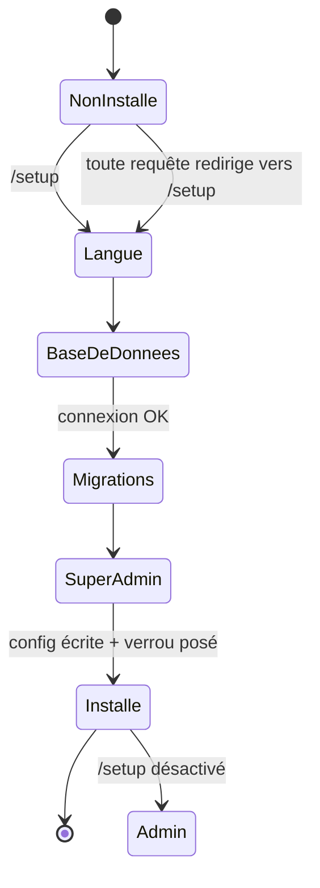

# Assistant de mise en place

!!! info "Statut : 🔜 planifié (Phase 0)"
    Cette page décrit l'assistant d'installation tel qu'il est **conçu**. Il n'est pas
    encore implémenté — voir la [feuille de route](../feuille-de-route.md).

Mettre en place une instance Koyarwa pour un établissement se fait via un **assistant
d'installation** guidé, sans éditer de fichier à la main. Tant qu'une instance n'est pas
installée, l'application démarre en **mode installation** : toute requête est redirigée
vers `/setup`.

## Étapes

### 1. Langue

Choix de la langue de l'assistant, qui devient aussi la **langue par défaut de
l'instance** : **français**, **anglais** ou **allemand**. Voir
[Langues & base de données](../administration/configuration.md).

### 2. Base de données

Sélection du **moteur** et saisie des paramètres de connexion :

| Champ | Exemple |
|---|---|
| Moteur | PostgreSQL · MySQL |
| Hôte / Port | `localhost` / `5432` |
| Utilisateur / Mot de passe | `koyarwa` / … |
| Base | `koyarwa` |

Un bouton **« Tester la connexion »** vérifie l'accès **avant** de continuer : l'assistant
ne passe à l'étape suivante que si la connexion aboutit.

### 3. Création du schéma

L'assistant applique les **migrations** (schéma des tables) sur la base, pour le moteur choisi.

### 4. Compte super-administrateur

Création du premier compte, disposant de tous les droits : **nom**, **e-mail**,
**mot de passe** (stocké haché). Ce compte servira à se connecter à l'espace
d'administration.

### 5. Finalisation

L'assistant :

1. écrit la **configuration d'instance** (moteur + connexion + langue) dans un emplacement persistant ;
2. pose un **verrou d'installation** ;
3. redirige vers l'[espace d'administration](../administration/espace-administration.md).

Une fois l'instance installée, `/setup` est **désactivé**.

## Fonctionnement interne

- **Mode installation** : un intergiciel (*setup-gate*) redirige tout vers `/setup` tant
  que le verrou d'installation est absent (les fichiers statiques restent servis).
- **Connexion à la base paresseuse** : le moteur de base n'est créé qu'**après**
  l'installation ; l'application peut donc tourner sans base pendant l'installation.
- **Persistance** : la configuration d'instance et le verrou sont écrits dans un
  répertoire persistant (monté sur volume en conteneur), hors du dépôt de code.

## Sécurité

- L'assistant n'est accessible **que** tant que l'instance n'est pas installée ; une fois
  le verrou posé, il n'est plus possible de relancer l'installation depuis le web.
- Le mot de passe du super-administrateur est **haché** avant stockage.
- Les identifiants de base de données ne sont jamais renvoyés au navigateur.
