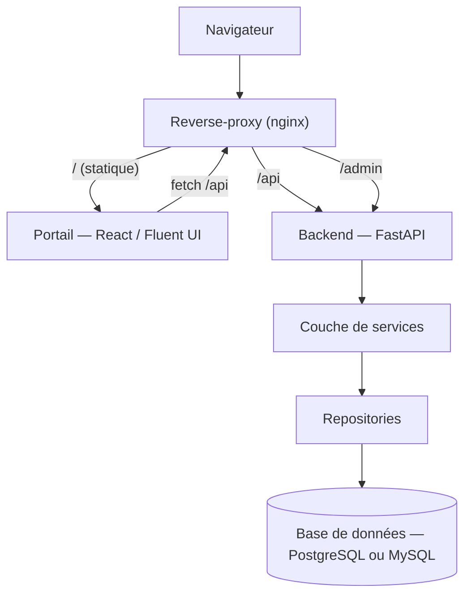

# Architecture

## Vue d'ensemble runtime

Une instance Koyarwa réunit un **backend** (API + espace d'administration), un
**portail** web et une **base de données**, servis derrière un reverse-proxy.



- Le **portail** est une application React servie en statique ; il consomme l'**API REST**.
- L'**espace d'administration** est rendu côté serveur (HTML) par le backend, sous `/admin`.
- Les deux passent par la **même couche de services**, qui parle à la base via des **repositories**.

## Le backend : tranches verticales

Le backend est un **monolithe modulaire** organisé en *tranches verticales*
(*vertical slices*) : le code est regroupé **par domaine métier**, pas par couche technique.

```
backend/src/koyarwa/
├── main.py            # app FastAPI : middlewares + montage des routeurs (API & admin)
├── api/               # couche de livraison JSON
│   └── v1/router.py   # agrège les routeurs d'API des features
├── admin/             # couche de livraison HTML (espace d'administration)
├── core/              # fondations transverses (aucun métier)
│   ├── config/        # réglages par domaine (app, admin, base, cors…)
│   ├── env/           # résolution du fichier d'environnement
│   └── db/            # base déclarative + session
└── features/          # le métier, une tranche par domaine
    ├── health/        # disponibilité
    └── announcements/ # exemple : schemas · repository · service · router
```

**Règle de dépendance** unidirectionnelle : `livraison (api, admin) → features → core`.
Une feature ne dépend jamais d'une autre directement ; elle expose des services que les
routeurs consomment.

### Une feature type

Chaque domaine (`identity`, `catalog`, `enrolment`, `grades`…) suit le même gabarit :

| Fichier | Rôle |
|---|---|
| `schemas.py` | DTO d'entrée/sortie (Pydantic) |
| `models.py` | tables (SQLAlchemy) |
| `repository.py` | port de persistance + implémentation |
| `service.py` | logique métier, indépendante du canal |
| `router.py` | endpoints d'API |
| *(pages admin)* | écrans de gestion, dans `admin/` |

> Le port **repository** isole la logique de la base : c'est lui qui permet de viser
> plusieurs moteurs (PostgreSQL, MySQL) avec la même logique métier.

## Configuration

Tout passe par l'environnement, sans valeur métier en dur. Les réglages sont découpés
en **sections** préfixées (`APP_`, `ADMIN_`, `DB_`, `CORS_`, `RATELIMIT_`), lues via
`settings.<section>.<champ>`. Les secrets sont typés en `SecretStr`.

Pour une instance installée, la section **base de données** est renseignée par
l'[assistant de mise en place](../demarrage/installeur.md) puis lue au démarrage.

## Déploiement

- **Développement** : backend en `uvicorn --reload`, portail en serveur de dev Vite.
- **Production** : conteneurs Docker — backend (image Python/uv) et portail (build
  compilé servi par nginx, qui proxifie `/api` et `/admin` vers le backend) —
  orchestrés par `docker-compose`, plus la base de données.

Chaque établissement exploite **son propre déploiement** (voir
[Vue d'ensemble](vue-densemble.md#une-instance-par-etablissement)).

## Choix structurants

Les décisions d'architecture (isolation par instance, moteurs de base supportés,
modèle de rôles, activités polymorphes) sont détaillées dans
[Modèle de données › Vue d'ensemble](../modele-de-donnees/vue-densemble.md#decisions-structurantes).
