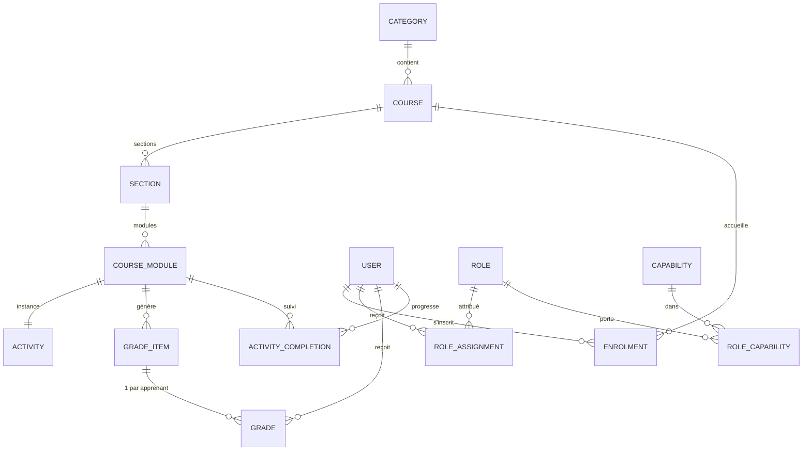

# Modèle de données — vue d'ensemble

Le modèle est organisé en **modules** (une tranche verticale par domaine). Cette page en
donne la colonne vertébrale et les décisions structurantes ; la
[référence des entités](reference-entites.md) détaille les champs.

## Le cœur du domaine

En une phrase : un **utilisateur** rejoint un **cours** par l'**inscription**, y suit des
**activités** organisées en **sections**, récolte des **notes** et un **achèvement**, le
tout gouverné par des **rôles** attribués à une portée.

L'**inscription** est la relation pivot (utilisateur ↔ cours) : elle porte le rôle par
défaut, la méthode et la période. Le **module de cours** est générique, avec une table par
type d'activité derrière lui.

## Les huit modules

| Module | Rôle | Entités principales |
|---|---|---|
| `identity` | comptes & authentification | User, AuthIdentity |
| `rbac` | rôles & droits | Role, Capability, RoleCapability, RoleAssignment |
| `catalog` | structure des cours | Category, Course, Section |
| `activities` | activités & ressources | CourseModule, Assignment, Resource, Quiz, Forum |
| `enrolment` | inscriptions & groupes | Enrolment, EnrolmentMethod, Group, Cohort |
| `grades` | notes & évaluation | GradeItem, Grade, GradeCategory, Scale |
| `completion` | achèvement & badges | ActivityCompletion, CourseCompletion, Badge |
| `files` | fichiers | Asset |

## Décisions structurantes

### Isolation : une instance par établissement

Chaque établissement a **sa propre base**. Il n'y a donc **pas de colonne `tenant_id`** :
l'isolation est physique. Le modèle reste simple, et l'[assistant de mise en
place](../demarrage/installeur.md) configure une instance = un établissement.

### Moteurs de base : PostgreSQL & MySQL

Adressés par une **couche d'abstraction unique** (SQLAlchemy) : une seule implémentation
des repositories couvre les deux. Le domaine étant fortement relationnel, les moteurs
relationnels sont le choix naturel (voir [Base de données](../administration/configuration.md#base-de-donnees)).

### Rôles & droits : rôles + capacités à trois portées

Les droits reposent sur des **rôles** (paquets de **capacités**) attribués à une
**portée** (site · catégorie · cours), résolus du plus précis au plus large. Permissions
`allow`/`prevent`. Voir [Utilisateurs & rôles](../administration/utilisateurs-et-roles.md#roles-et-permissions).

### Activités polymorphes : module générique + table par type

Un `CourseModule` générique (position, visibilité, achèvement, conditions d'accès) pointe
vers une **instance typée** (`Assignment`, `Quiz`, `Forum`, `Resource`…). Ajouter un type
d'activité = ajouter une table + son service, sans toucher à l'existant.
